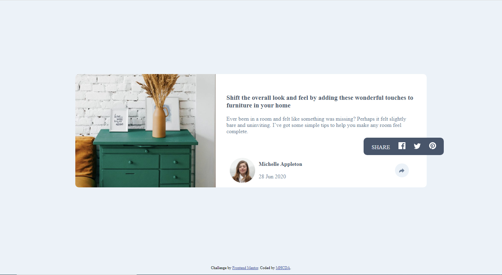
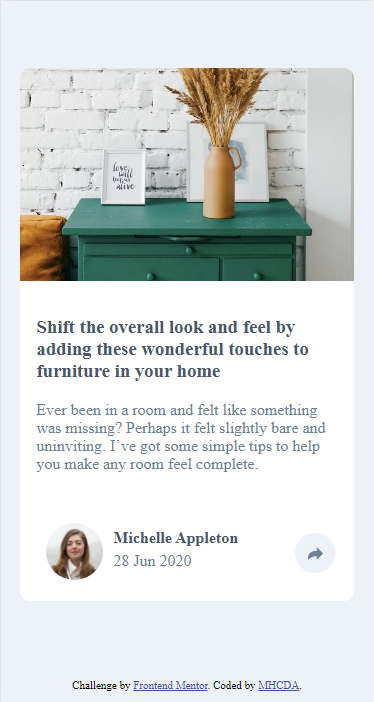
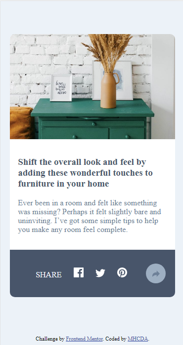

# Frontend Mentor - Article preview component solution

This is a solution to the [Article preview component challenge on Frontend Mentor](https://www.frontendmentor.io/challenges/article-preview-component-dYBN_pYFT). Frontend Mentor challenges help you improve your coding skills by building realistic projects. 

## Table of contents

- [Overview](#overview)
  - [The challenge](#the-challenge)
  - [Screenshot](#screenshot)
- [My process](#my-process)
  - [Built with](#built-with)
  - [Useful resources](#useful-resources)
- [Author](#author)

## Overview

  - In this challenge i am not quite sure i made  the desktop share pop out design as good as it should be by what i mean is the alignment so i'd rely apppreciate if you give me a tip on how can i accomplish that but the rest is done as it should be .

### The challenge

Users should be able to:

- View the optimal layout for the component depending on their device's screen size
- See the social media share links when they click the share icon

### Screenshot

## My process

- first i bulit it with mobile first and then desktop after all of that the js functionality

### Built with

- Semantic HTML5 markup
- CSS custom properties
- Flexbox
- CSS Grid
- Mobile-first workflow
- Js

### Useful resources

- [Example resource 1](https://www.w3schools.com) - Best referance for every html css and js codes
- [Example resource 2](https://www.mdn.com) - Best for more detial explaination on every css js html properties or more in my openion

## Author

- MHCDA WEB - [Personal Website](https://l.instagram.com/?u=https%3A%2F%2Fmhcdaeth.github.io%2Fmhcda-eth-web-v2.0%2F&e=ATPAww3rFG5eut5TBkT5JUcz9pju1Or8E1VaQyVT1fWS6D3_cLLe5tsUEGmN_pBT1FEnFj8wRmuSvyAWc19S7hA&s=1)
- Frontend Mentor - [@mhcdaeth](https://www.frontendmentor.io/profile/mhcdaeth)
- Twitter - [@MhcdaE](https://twitter.com/MhcdaE/)
